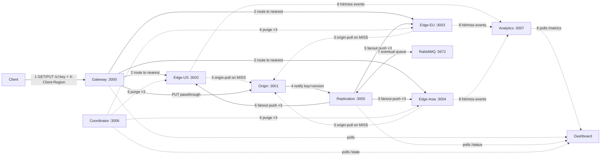

# Content Delivery Network (CDN) — Microservices Simulation 

Simulated CDN: origin (authoritative) + 3 edge caches (US/EU/Asia) + replication (sync/async) + invalidation coordinator + analytics + gateway router + React dashboard. See `docs/ARCHITECTURE.md` and `docs/API.md`.

## Quick start (no docker — recommended here)

```bash
./scripts/run-local.sh
./scripts/demo-hit-miss.sh
./scripts/demo-consistency.sh
./scripts/demo-invalidate.sh
node scripts/load-test.js
./scripts/stop-local.sh            # stop (verifies ports free)
./scripts/stop-local.sh --clean    # stop + wipe DBs/blobs for a fresh slate
./scripts/stop-local.sh --hard     # SIGKILL anything still on ports 3000-3007
```

Dashboard (needs `npm install` in `web/dashboard`): `npm run dev` → http://localhost:5173

## Docker (needs docker engine)

```bash
docker compose up --build
# dashboard → http://localhost:8080, gateway → :3000, rabbitmq mgmt → :15672
```

## How services talk



Solid = sync HTTP · dashed = pull on miss / async events / queue.

| From → To | When | What |
|---|---|---|
| Client → Gateway | every read/write | `GET/PUT /c/:key`, `X-Client-Region` picks the edge |
| Gateway → Edge | every read | proxy to nearest edge (`X-Route-Reason`) |
| Gateway → Origin | every write | PUT passthrough |
| Edge → Origin | cache MISS only | `GET /content/:key`, then cache with TTL |
| Origin → Replication | every write/delete | `POST /internal/notify {key, version, op}` |
| Replication → Edges | every write/delete | `POST /internal/replicate` — sync in strong mode, after `lagMs` in eventual |
| Replication ↔ RabbitMQ | eventual mode only | `cdn.replication` fanout (falls back to delayed HTTP if unset) |
| Coordinator → Edges | on invalidate | `DELETE /cache/:key` fanout (+ MQ broadcast) |
| Edges → Analytics | every edge GET | fire-and-forget `POST /events {hit/miss, latencies}` |
| Dashboard → Gateway/Repl/Coord/Analytics | every 2 s | tester calls + status/matrix/metrics polls |

See the **Architecture & flow** tab in the dashboard for the same diagram, clickable per service.

## Demos → success criteria
1. HIT (~ms) vs MISS (~origin fetch) latency gap — `demo-hit-miss.sh` + dashboard hit-ratio chart.
2. Eventual staleness window vs strong write latency — `demo-consistency.sh` + consistency matrix.
3. Purge propagation — `demo-invalidate.sh`.

## Tests
```bash
node --test "tests/*.test.js"
```
